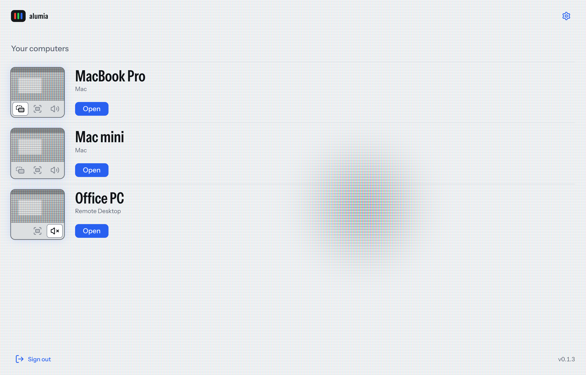
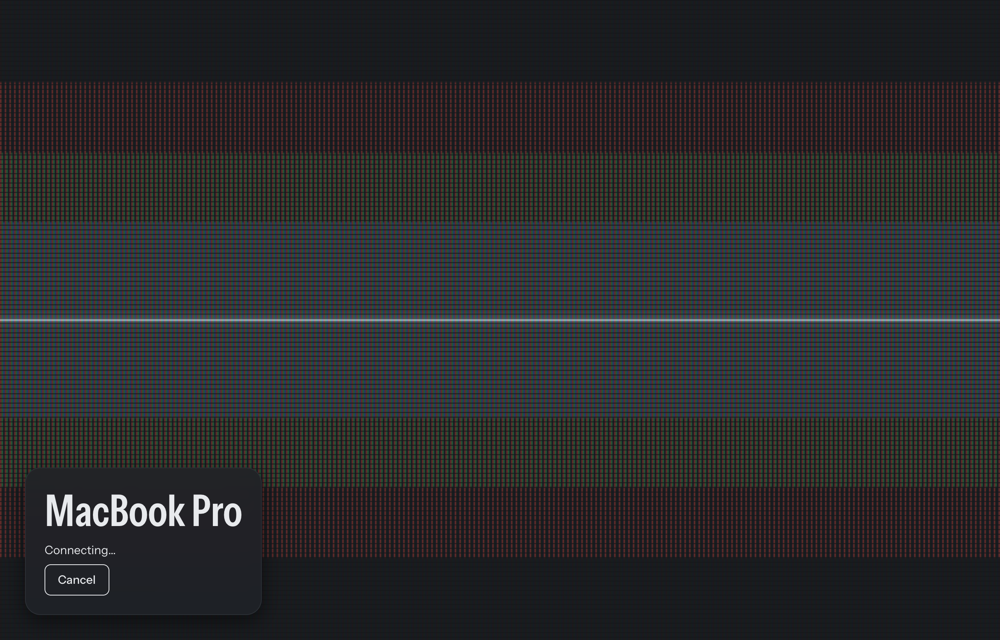
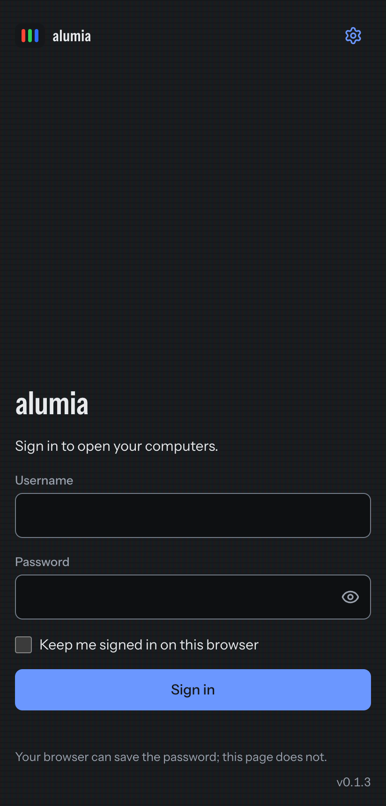
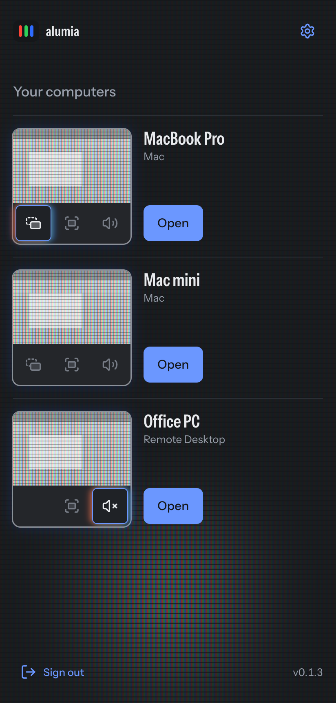
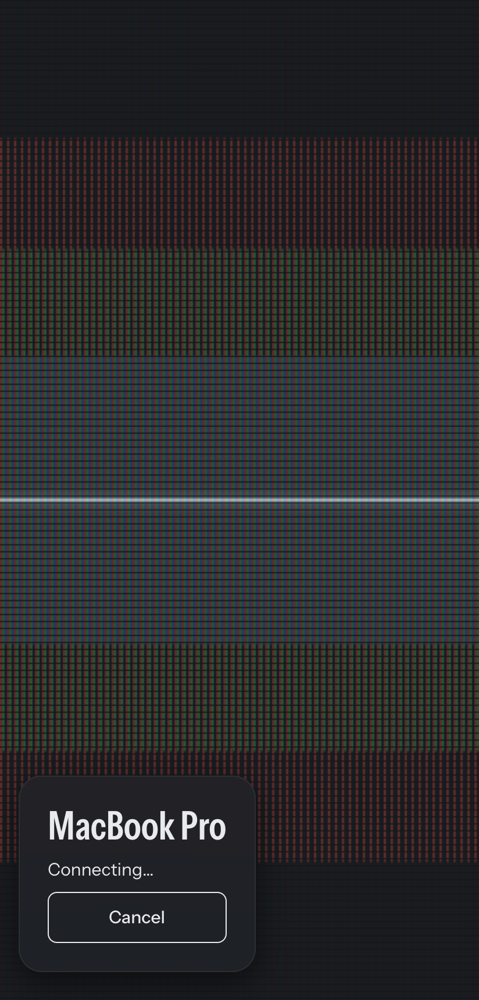
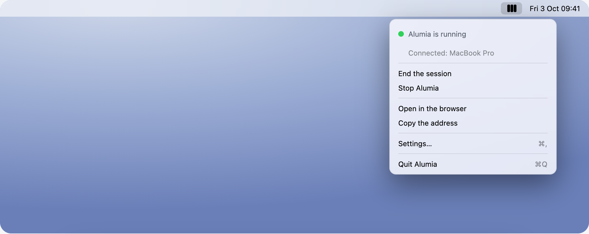
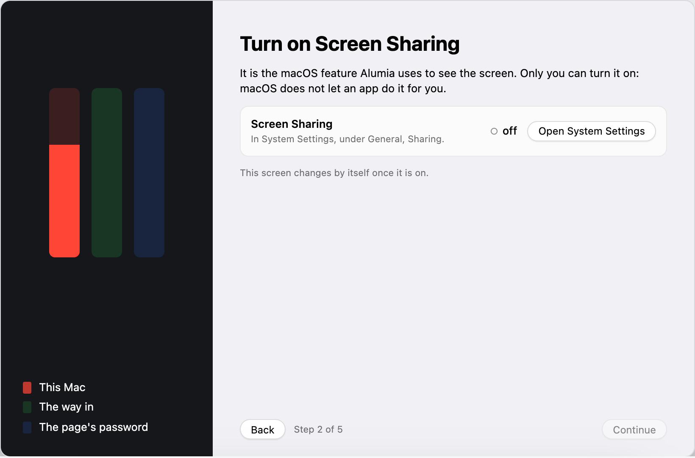
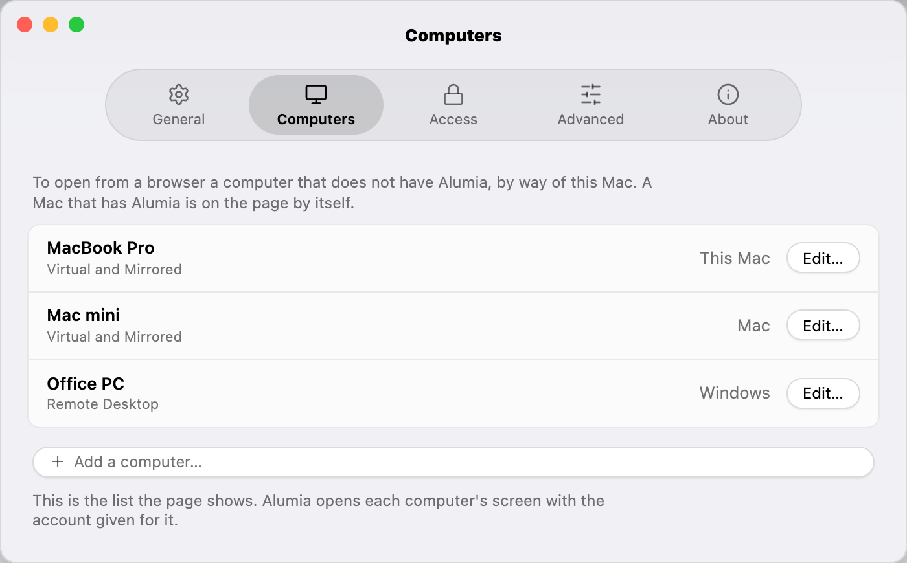

<p align="center"><picture><source media="(prefers-color-scheme: dark)" srcset="docs/readme/alumia-escuro.svg"></picture></p>

English · [Português](README.pt-BR.md)

Your computers, from any browser. An app on the Mac, a page everywhere else.

## What it is

Alumia runs on a machine of yours. You sign in to its page from any device and
open a Mac, a Windows PC or a Linux desktop, with picture, sound, keyboard,
pointer and clipboard. One person at a time, and nothing to install on the
device you open from.

Each computer is opened through the remote access it already has. None gets
Alumia.

<picture><source media="(prefers-color-scheme: dark)" srcset="docs/readme/lista-escuro-en.png"></picture>

## In a session


The whole remote screen and one glass bar: full screen, screens, sound,
keyboard, clipboard, end. On opening, the screen lights from the point touched
and dissolves over the picture.



## On a phone

<p align="center">  </p>

The picture arrives at the width you see it at; a pinch zooms in. Fingers are
a trackpad and the keyboard is the device's.

## On a Mac, an app

<picture><source media="(prefers-color-scheme: dark)" srcset="docs/readme/app-menu-escuro-en.png"></picture>

On a Mac with Apple Silicon and macOS 14 or newer, Alumia is an app: it
installs by dragging, takes you through the first run, keeps the server running
and says in the menu bar what it is doing.

<picture><source media="(prefers-color-scheme: dark)" srcset="docs/readme/app-primeira-vez-escuro-en.png"></picture>

<picture><source media="(prefers-color-scheme: dark)" srcset="docs/readme/app-computadores-escuro-en.png"></picture>

[Download the disk image](https://github.com/aleonnet/alumia/releases/latest) ·
[Install and remove](docs/install.md#macos-app-dmg)

## What you open

| Computer | The picture | The sound |
|---|---|---|
| Mac, **Virtual** | Picture and sound come here; the Mac is left without either. | Always |
| Mac, **Mirrored** | Mirrors everything, with perfect sound. | Always |
| Windows, Remote Desktop | At the window's size. | Your choice |
| Linux, [wlshare](https://github.com/andrewtheguy/wlshare) | At the window's size, with camera and microphone. | Your choice |
| VNC, any server | At the server's size. | No sound |

## Without the app, on any machine

With [Rust](https://rustup.rs) and [Bun](https://bun.sh):

```sh
bun install --cwd frontend
cargo build --release
cp alumia.example.toml alumia.toml
./target/release/alumia gen-passwd admin
./target/release/alumia serve -c alumia.toml
```

The computers and the password live in `alumia.toml`. Then
<http://localhost:52380>.

## Documentation

- [Servers, modes and media](docs/servers.md)
- [Installing](docs/install.md)
- [The Mac app](docs/mac-app.md)
- [Changelog](CHANGELOG.md)

## Contributing

This repository is a photograph of each version of alumia, written by its
publication from `aleonnet/alumia-app`, where the work happens and which is
private. Something that does not work, or a question, goes in the
[issues](https://github.com/aleonnet/alumia/issues) here.

Began as [remotex](https://github.com/andrewtheguy/remotex), by Andrew Chen.
MIT licence, in [`LICENSE`](LICENSE). Alumia, Alessandro Barbosa, 2026.
