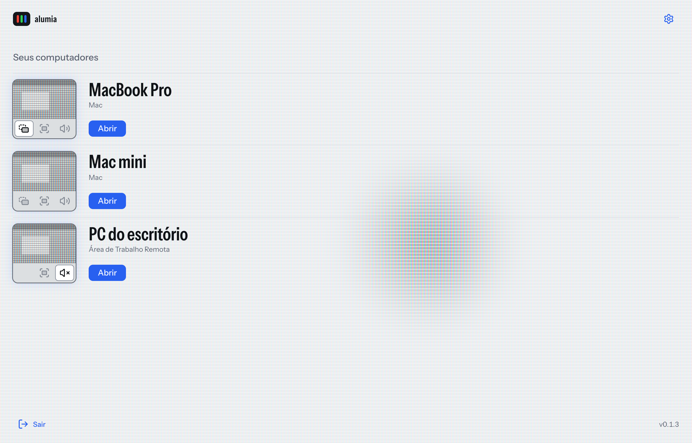
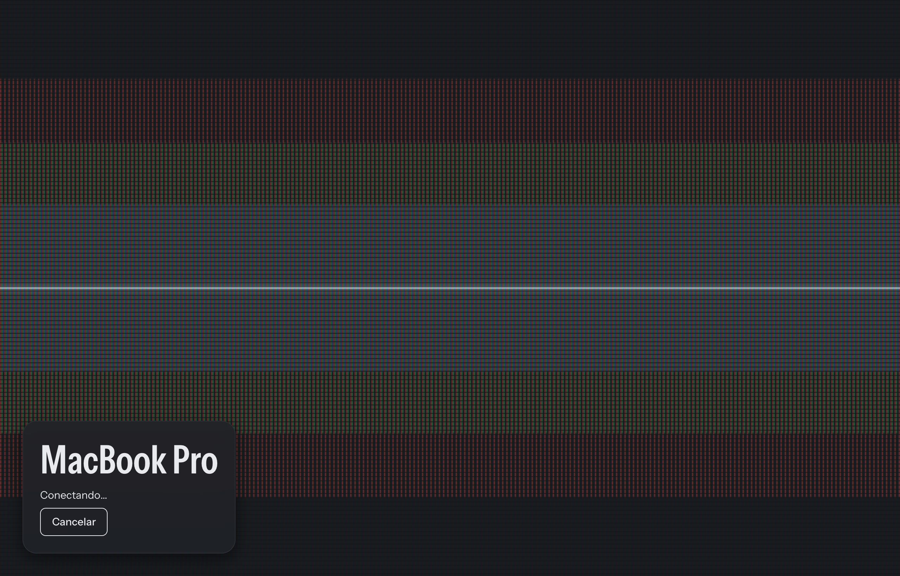
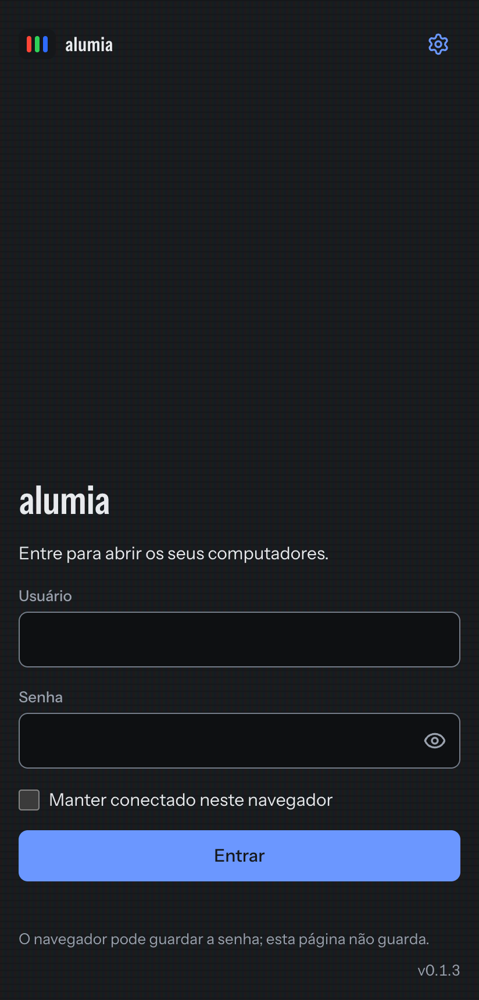
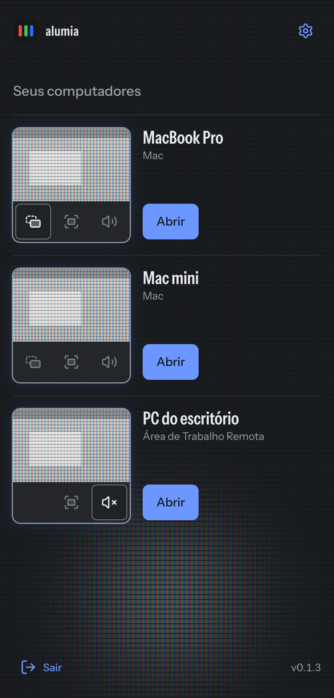
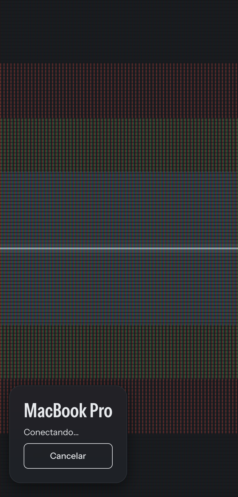
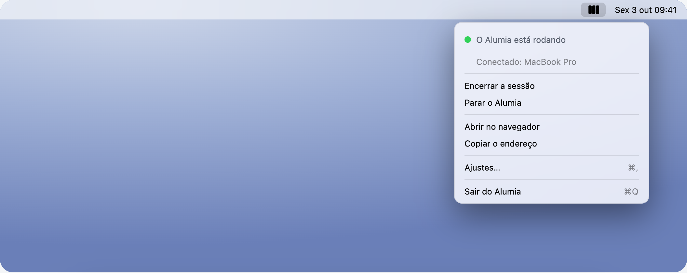
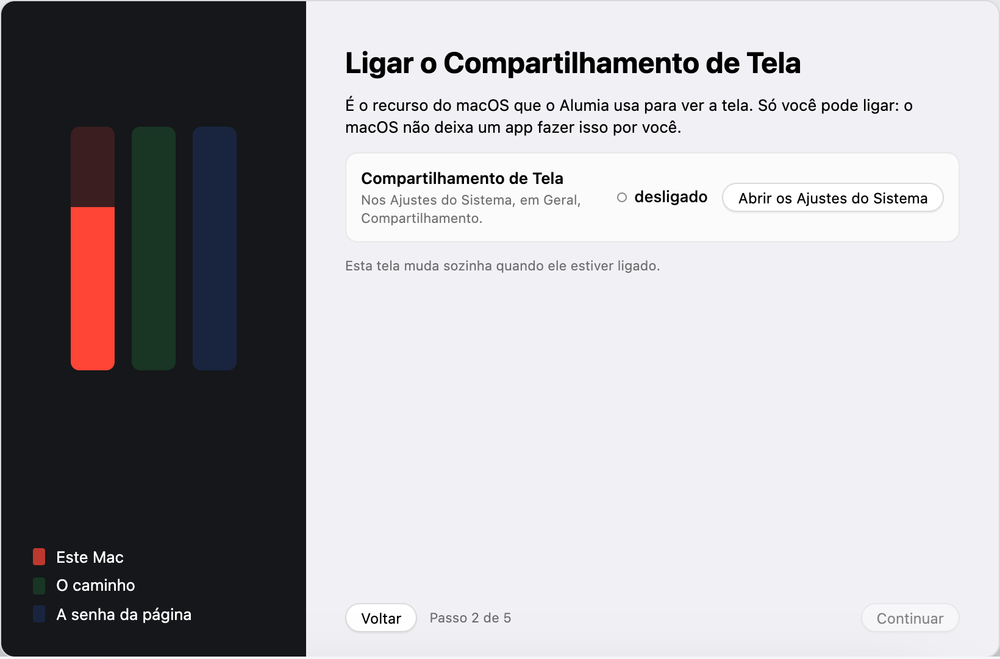
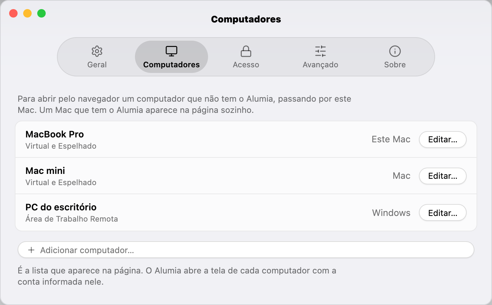

<p align="center"><picture><source media="(prefers-color-scheme: dark)" srcset="docs/readme/alumia-escuro.svg"></picture></p>

[English](README.md) · Português

Seus computadores, de qualquer navegador. Um app no Mac, uma página em todo o
resto.

## O que é

O Alumia roda numa máquina sua. Você entra na página dele de qualquer aparelho
e abre um Mac, um Windows ou um Linux, com imagem, som, teclado, ponteiro e área
de transferência. Uma pessoa por vez, e nada para instalar no aparelho de onde
você abre.

Cada computador é aberto pelo acesso remoto que já tem. Nenhum recebe o Alumia.

<picture><source media="(prefers-color-scheme: dark)" srcset="docs/readme/lista-escuro-pt.png"></picture>

## Na sessão


A tela remota inteira e uma barra de vidro: tela cheia, telas, som, teclado,
área de transferência, encerrar. Ao abrir, a tela acende do ponto tocado e se
dissolve sobre a imagem.



## No celular

<p align="center">  </p>

A imagem chega na largura em que você a vê; a pinça aproxima. Os dedos são um
trackpad e o teclado é o do aparelho.

## No Mac, um app

<picture><source media="(prefers-color-scheme: dark)" srcset="docs/readme/app-menu-escuro-pt.png"></picture>

Num Mac com Apple Silicon e macOS 14 ou mais novo, o Alumia é um app: instala
arrastando, leva você pela primeira vez, mantém o servidor rodando e diz na
barra de menus o que está fazendo.

<picture><source media="(prefers-color-scheme: dark)" srcset="docs/readme/app-primeira-vez-escuro-pt.png"></picture>

<picture><source media="(prefers-color-scheme: dark)" srcset="docs/readme/app-computadores-escuro-pt.png"></picture>

[Baixar a imagem de disco](https://github.com/aleonnet/alumia/releases/latest) ·
[Instalar e remover](docs/install.md#macos-app-dmg)

## O que você abre

| Computador | A imagem | O som |
|---|---|---|
| Mac, **Virtual** | Imagem e som vêm para cá; o Mac fica sem imagem e sem som. | Sempre |
| Mac, **Espelhado** | Espelha tudo, com o som perfeito. | Sempre |
| Windows, Área de Trabalho Remota | Do tamanho da janela. | Você escolhe |
| Linux, [wlshare](https://github.com/andrewtheguy/wlshare) | Do tamanho da janela, com câmera e microfone. | Você escolhe |
| VNC, qualquer servidor | Do tamanho do servidor. | Sem som |

## Sem o app, em qualquer máquina

Com [Rust](https://rustup.rs) e [Bun](https://bun.sh):

```sh
bun install --cwd frontend
cargo build --release
cp alumia.example.toml alumia.toml
./target/release/alumia gen-passwd admin
./target/release/alumia serve -c alumia.toml
```

Os computadores e a senha ficam em `alumia.toml`. Depois,
<http://localhost:52380>.

## Documentação

- [Servidores, modos e mídia](docs/servers.md)
- [Instalar](docs/install.md)
- [O app de Mac](docs/mac-app.md)
- [Mudanças](CHANGELOG.pt-BR.md)

## Contribuir

Este repositório é a foto de cada versão do alumia, escrita pela publicação a
partir do `aleonnet/alumia-app`, onde o trabalho acontece e que é privado. O
que não funciona, ou uma dúvida, vai nas
[issues](https://github.com/aleonnet/alumia/issues) daqui.

Começou como [remotex](https://github.com/andrewtheguy/remotex), de Andrew
Chen. Licença MIT, em [`LICENSE`](LICENSE). Alumia, Alessandro Barbosa, 2026.
